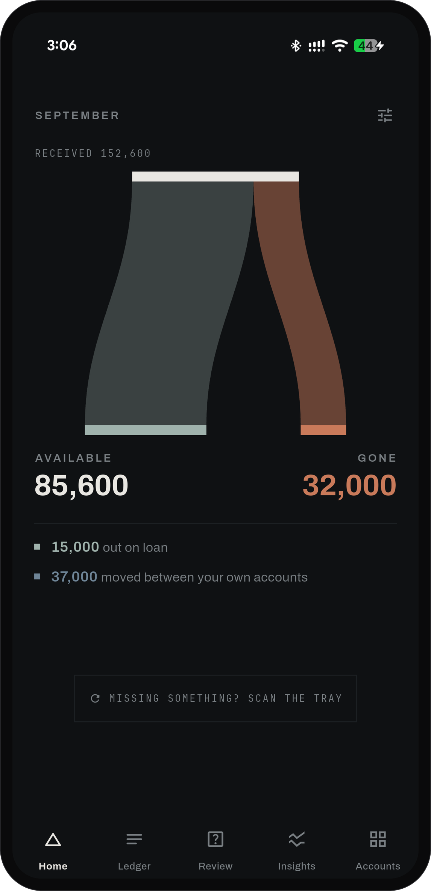
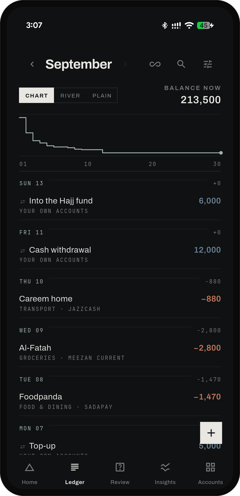
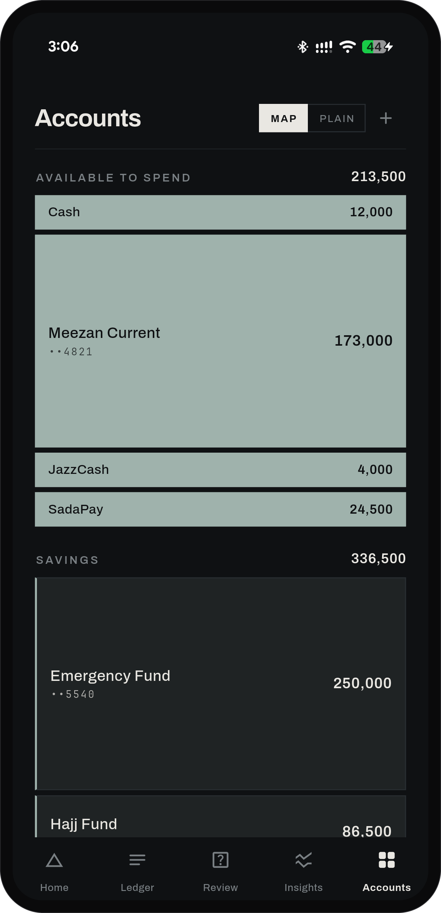
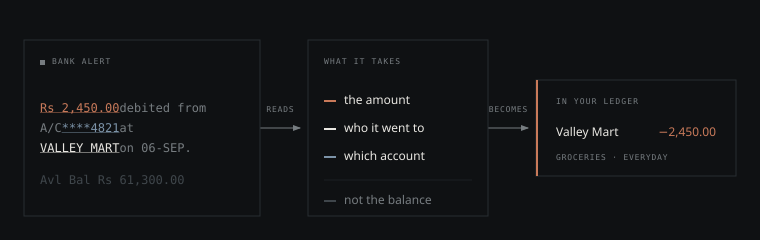
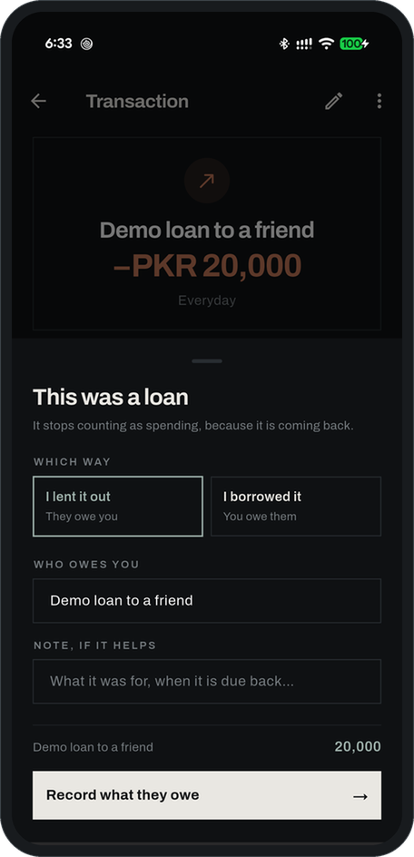
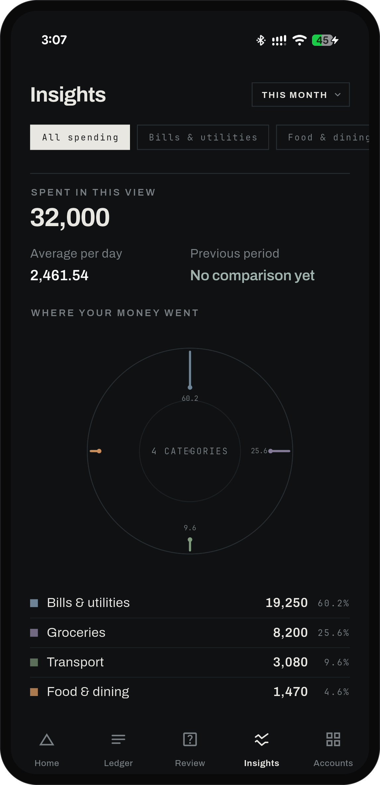

<div align="center">


# SpendWise

### Your bank already tells you everything.

SpendWise turns the alerts you already get into a ledger you never had to type.<br>
It runs entirely on your phone and has no internet permission at all.

[](https://github.com/abdullah270602/spendwise-local/actions/workflows/flutter.yml)
[](https://github.com/abdullah270602/spendwise-local/releases/latest)
[](LICENSE)

**[Download for Android →](https://github.com/abdullah270602/spendwise-local/releases/latest)**

</div>

<br>

<div align="center">

&nbsp;

&nbsp;

</div>

<br>

## Why this exists

I kept losing track of my own money.

Not for lack of apps. I tried plenty. Every one of them wanted me to connect
something that does not connect here, or to sit down at the end of the week and
type in what I had already done. The banks were not integrated. The wallets
were not integrated. So the work fell back to me, by hand — and the moment I
stopped doing it, the picture went stale and the app became a lie.

Meanwhile my phone was already being told everything. Every payment, every
transfer, every salary: an alert arrives within seconds of the money moving.
The information was never missing. It was just never collected.

So I built the thing that collects it.

<br>

## How it reads an alert

<div align="center">

</div>

SpendWise reads the sentence, not just the numbers in it: which way the money
went, who was on the other end, and which of your accounts it touched.

That last part matters more than it sounds. The amount you spent usually sits
right next to the available balance, which is a much larger number meaning
something else entirely — and the direction comes from the verb, because most
alerts carry no plus or minus at all.

When it is unsure, it says so rather than guessing. Ten alerts uncertain for
the same reason become **one** question in Review, not ten — and an alert it
cannot read at all is not a dead end: say which way the money went and it
files the rest itself.

<br>

## What it does

**Reads your alerts.** Banks, wallets, and your messages app — but only the
ones you pick. Everything else on your phone stays invisible to it.

**Keeps one ledger.** A bank alert and its SMS twin describe one payment, not
two. Duplicates collapse, and money moved between your own accounts counts as
neither income nor spending.

**Answers one question on Home.** Of everything that arrived, how much is still
yours — drawn to true proportion, over whatever stretch of time matches your
pay cycle.

**Separates savings from spendable.** Savings stay visible and stay out of
*available to spend*.

**Knows lending from spending.** Money you lent is coming back, so it stops
counting against your month.

**Learns where things go.** File the same shop or person under the same
category three times and SpendWise starts doing it for you. Disagree once and
it stops.

**Gives it all back.** A PDF report, or the whole ledger as CSV or JSON.
Nothing here is locked in.

**Locks, if you want.** A PIN of any length, with a fingerprint as the fast
path.

<div align="center">
<br>

&nbsp;

&nbsp;

</div>

<br>

## Privacy, checked rather than claimed

**There is no internet permission.** Not disabled, not opted out of — never
requested. Android will not grant SpendWise network access, so there is no
server to send anything to and none to be breached. The app shows you its own
permission list, read from the installed package, under *Settings → How
SpendWise works → Privacy*.

**The ledger is encrypted on the phone.** SQLCipher, with the key held by the
Android keystore. Notification text is encrypted before it is even handed to
the app.

**Nothing syncs or backs up.** Android backup and device-transfer extraction
are switched off. Data leaves only when you export it yourself, to a file you
choose.

There is no account, no cloud, no telemetry, no analytics, no advertising, no
crash reporter, and no AI service.

What this cannot do is protect an already-unlocked, compromised device. See
[SECURITY.md](SECURITY.md) for the exact trust boundary.

<br>

## Install

Download the APK from the [latest release](https://github.com/abdullah270602/spendwise-local/releases/latest).
Most phones want **arm64-v8a**; take the **universal** build if you are unsure.

Android 7.0 or newer. Because it is installed outside Google Play, Android will
warn you about an unknown app, and on Android 13+ the notification-access
toggle stays greyed out until you allow it:

> App info → ⋮ → **Allow restricted settings**

The app says so at the moment it matters. Notification access is an Android
Settings grant, not a normal runtime permission — SpendWise cannot turn it on
for you.

> **Note on signing.** Release APKs here are signed with the Android debug key,
> which every developer machine holds. Fine for trying it; not proof of origin.

<br>

## Build from source

Flutter 3.47+, Dart 3.13+, Android SDK 37, JDK 17+.

```bash
flutter pub get
flutter analyze
flutter test
flutter build apk --release
```

## Layout

| | |
|---|---|
| `lib/domain` | money, evidence, parsing, reconciliation — pure Dart |
| `lib/data` | the SQLCipher ledger |
| `lib/platform` | the notification bridge |
| `lib/features` | the screens |
| `android/…/com/spendwise/app` | encrypted notification capture and queue |

[ARCHITECTURE.md](ARCHITECTURE.md) has the invariants and the data flow.

## Contributing

Start with [CONTRIBUTING.md](CONTRIBUTING.md). Use sanitized fixtures only —
never commit real notifications, statements, account numbers, or names.

Report vulnerabilities through a
[private advisory](https://github.com/abdullah270602/spendwise-local/security/advisories/new),
not a public issue.

## License

MIT
